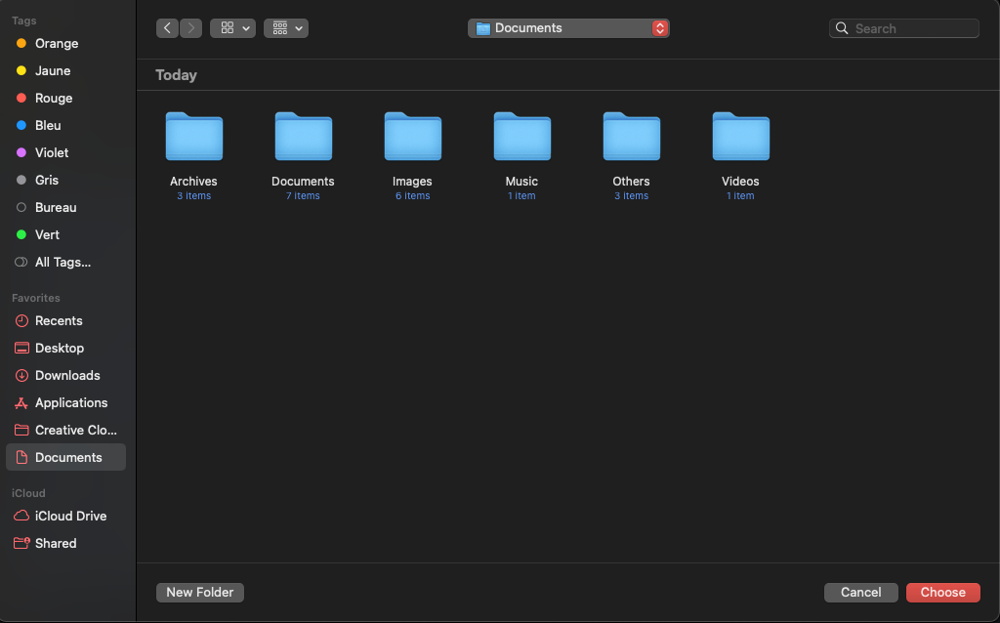

# CleanMyFils

**CleanMyFils** est un projet Python conçu pour organiser automatiquement les fichiers d'un répertoire. Il classe les fichiers en différentes catégories (Images, Vidéos, Documents, Musique, Archives, Autres) en fonction de leur extension. Ce projet utilise une interface graphique avec `Tkinter` et `ttkbootstrap` pour faciliter l'interaction avec l'utilisateur.

## Aperçu du projet

Voici un aperçu de l'interface graphique du projet avec les différentes étapes d'utilisation :

<div style="display: flex; justify-content: space-between; gap: 10px;">
  
  
  
</div>

## Fonctionnalités

- Organiser les fichiers dans un répertoire par catégorie.
- Catégoriser les fichiers par type : Images, Vidéos, Documents, Musique, Archives, Autres.
- Interface utilisateur simple et intuitive avec Tkinter.
- Choix de langue (Anglais / Français).
- Lien direct vers mon profil GitHub pour plus d'informations.

## Technologies utilisées

- **Python** : Langage de programmation principal.
- **Tkinter** : Bibliothèque pour l'interface graphique.
- **ttkbootstrap** : Extension de Tkinter.
- **shutil** : Pour déplacer les fichiers.
- **os** : Pour interagir avec le système de fichiers.

## Installation

### Prérequis

Avant d'exécuter le projet, vous devez avoir Python installé sur votre machine. Vous pouvez télécharger Python à partir de [python.org](https://www.python.org/downloads/).

### Cloner le projet

Clonez ce projet en utilisant Git :

(MacOS)
```bash
git clone https://github.com/MatthieuGillieron/CleanMyFils.git
cd CleanMyFils
./setup.sh
python script.py
